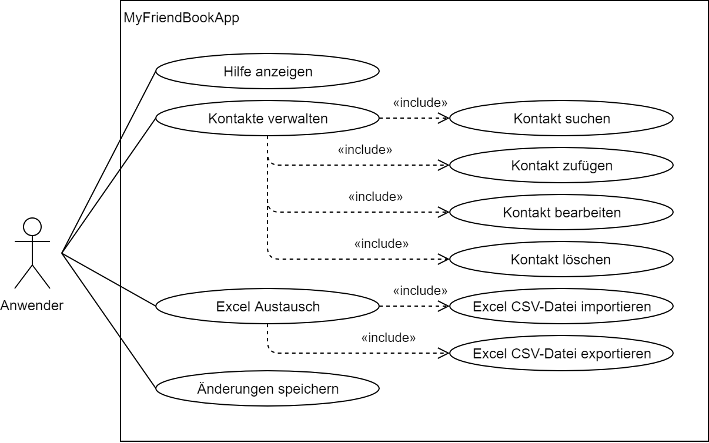

Lernziele
=========

-   Entwickeln .NET Core Konsolenanwendung zur Datenverwaltung

-   Benutzerinteraktion mit Kommandomenü steuern

-   Konzept einer gezielten Methodenstruktur nutzen

-   Datentyp *String* und Verarbeitungsmethoden verwenden

-   Arrays zur internen Datenhaltung nutzen

-   Datentyp *Char*, Zeichensätze und Codepages kennen lernen

-   Dateiablage in Textzeilenformat programmieren

Voraussetzungen
===============

-   Erste C\# Konsolenanwendung mit Interaktion bereits entwickelt (z.B.
    Taschenrechner)

-   Nutzung von geeigneten Programmierbüchern zu C\#

Format
======

-   Programmstruktur und Benutzerinteraktion wird vorgegeben

-   Die Entwicklung erfolgt in Lernschritten stufenweise bis zur
    fertigen Anwendung

-   Zu den Lernschritten werden passend Lerninhalte beigesteuert

-   Einzelne Aufgaben setzten den Übungsfokus

Arbeitsweise
============

-   Partnerarbeit mit stetigem Wechsel an der Tastatur (Programmierer
    Berater/Prüfer)

-   Die Teilergebnisse werden stufenweise gesichert

-   Die Studierenden führen ein Arbeitsprotokoll
    (*LS-MyFriendBookApp-Tagebuch.xlsx*)

-   Zu den Übungen ist ein fortlaufendes Textdokument pro Partnergruppe
    für die Ergebnisse zu pflegen

Lernschritte
============

Funktionale Anforderungen
-------------------------

Das UML-Anwendungsfalldiagramm (Bild1) zeigt die geforderten Funktionen
des Programms. Dieses Diagramm ist für den deutschsprachigen Anwender
angefertigt. Ein Leser ohne Programmierkenntnisse kann es verstehen.

 Bild 1 -- Anwendungsfalldiagramm

**Recherche:**
Recherchieren Sie zu UML: Wofür steht UML. Welches ist die aktuelle
Version der UML, Wie viele Diagrammarten gibt es zurzeit. Zu welcher
Kategorie gehören Anwendungsfalldiagramme der UML.

Daten der Anwendung
-------------------

Kontaktdaten sollen nach Vor- und Nachname geführt werden. Beliebige
weitere Attribute sollen zusätzlich als Textwerte möglich sein, aber
ohne geforderte Anzahl oder vorgegebenen Zweck. Denkbar sind damit nach
Bedarf etwa Texte wie Telefon, Email, Adresse oder Notizen:

Kontakt als EBNF dargestellt:

Kontakte = {Kontakt};
Kontakt = (Vorname, Nachname) \| (Vorname) \| (Nachname), {Attribut};

**Recherche:**
Recherchieren Sie BNF und EBNF im Vergleich, entschlüsseln Sie die
Kontaktdefinition oben und notieren Sie diese dann in Form der BNF

Methodenstruktur
----------------

Die Funktionen des Programms werden in eigenen Methoden implementiert.
Die Hauptmethode *Main( )* beinhaltet eine Eingabemöglichkeit für
Suchtext oder Kommandooptionen, über welche die Funktionen des Programms
durch den Anwender genutzt werden können. Die in Tabelle 1 dargestellten
Methoden sind vorgegeben und entsprechend den folgenden Lernschritten zu
realisieren. Die weitern Kapitel beschreiben dabei die Anforderungen an
die einzelnen Methoden.

+-----------------------+-----------------------+-----------------------+
| Funktion im           | Methode im            |                       |
| Anwendungsfalldiagram |                       |                       |
| m                     | Quellcode             |                       |
+=======================+=======================+=======================+
| \-\--                 | static void Main( )   | Hauptprogramm mit     |
|                       |                       | Startbild             |
+-----------------------+-----------------------+-----------------------+
| Hilfe anzeigen        | static void ShowHelp( | Bedienungshilfe       |
|                       | )                     |                       |
+-----------------------+-----------------------+-----------------------+
| Kontakt zufügen       | static void           |                       |
|                       | ContactAdd( )         |                       |
+-----------------------+-----------------------+-----------------------+
| Kontakt suchen        | static void           | Suchtext              |
|                       | ContactSearch(string  | Ergebnisliste         |
|                       | pattern)              |                       |
+-----------------------+-----------------------+-----------------------+
| Kontakt bearbeiten    | static void           | Index der Anzeige     |
|                       | ContactEdit(int       |                       |
|                       | index)                |                       |
+-----------------------+-----------------------+-----------------------+
| Kontakt löschen       | static void           | Index der Anzeige     |
|                       | ContactRemove(int     |                       |
|                       | index)                |                       |
+-----------------------+-----------------------+-----------------------+
| Excel CSV-Datei       | static void           |                       |
| importieren           | ExcelImport(string    |                       |
|                       | path)                 |                       |
+-----------------------+-----------------------+-----------------------+
| Excel CSV-Datei       | static void           |                       |
| exportieren           | ExcelExport(string    |                       |
|                       | path)                 |                       |
+-----------------------+-----------------------+-----------------------+
| Änderungen speichern  | static void SaveAll(  | Auf Wunsch des        |
|                       | )                     | Anwenders             |
+-----------------------+-----------------------+-----------------------+

Tabelle 1 -- Programmfunktionen und Methodenstruktur

Programmerstellung
------------------

**Aufgabe:**
Erstellen Sie ein neues *.NET Core C\# Konsolenprojekt*.\
Das Projekt soll den Namen ***MyContactBookApp*** bekommen.

Nutzen Sie diesmal das .NET Core CLI (Command Line Interface) zunächst
ohne Visual Studio wie folgt.
Hierbei lernen Sie das Programm „*dotnet.exe*" kennen.

-   Verzeichnis *MyContactBookApp* anlegen und dort eine
    Kommandozeilenbox öffnen

-   Befehl „dotnet new console -lang C\#" .NET Core Projekt wird dort
    erzeugt

-   Befehl „dotnet build" .NET Core Projekt wird dort übersetzt

-   Befehl „dotnet run" .NET Core Projekt wird dort gestartet

-   Befehl „dotnet -h" zeigt an, was *dotnet.exe* noch alles anbietet

-   Explorerdoppelklick auf „*MyContactBookApp.csproj"* startet Visual
    Studio

Hinweis: Wir werden ab jetzt nicht mehr das herkömmliche *.NET
Framework*, sondern das plattformunabhängige ***.NET Core** Framework*
nutzen. Auf den Schulrechnern ist es bereits als Version 2.1
installiert. Sie müssen es ggf. auf Ihrem eigenen System mit dem *Visual
Studio Installer* nachinstallieren.

Hauptprogramm und Hilfefunktion
-------------------------------

Nach dem Starten der Anwendung soll folgende einfache Oberfläche
erscheinen, von der aus der Anwender später direkt Kontakte suchen kann
oder Programmfunktionen per Kommandooption nutzen kann. Der Rahmen des
Konsolenfensters trägt den Titel des Programms. Ebenso erscheint eine
Titelzeile im Textbereich.

Zunächst werden die Hilfefunktion, das Programmende und ein
Entwicklungshinweis ausgegeben, wie es aus dem folgenden Bild 2
ersichtlich wird.

{width="3.7326738845144356in"
height="5.09169072615923in"} Bild 2 -- Startbild und Hilfefunktion

Mit dem Kommandosymbol „?" erhält der Anwender eine Hilfefunktion über
alle Möglichkeiten.
Ferner kann der Anwender hier das Programmierteam (Ihre Namen) sehen und
die aktuelle Version der Software, die mit 1 beginnt und mit jedem
lauffähigen Zwischenstand hochgezählt werden soll.

Für die Anzeige der Hilfe soll die Methode *ShowHelp( )* s.o. Tabelle 1
implementiert werden und aus der Hauptmethode *Main( )* aufgerufen
werden, wenn der Anwender die Option „?" mit der Eingabetaste abschickt.

Das Bild 2 zeigt den Verlauf. Dort sind auch weitere erste
Programmreaktionen zu sehen.
Nach der Abschiedsnachricht muss der Anwender abschließend die
Eingabetaste drücken.

**Aufgabe:**
Implementieren Sie die Methoden *Main( )* und *ShowHelp( )* geeignet,
bis eine Interaktion à la Bild 2 möglich ist.

Alle Methoden anlegen mit Dummyfunktion
---------------------------------------

**Aufgabe:**
Implementieren Sie die restlichen Methoden aus Tabelle 1 mit
Dummyfunktion so, dass sie ggf. beim Aufruf eine Hinweiszeile wie \"Noch
nicht fertig: ...\" ausgeben würden.

Eingabefunktion
---------------

Ein Kontakt soll als *String-Array* (string\[ \]) realisiert werden. Das
erste Element soll den Vornamen, das zweite Element soll den Nachnamen
und alle weiteren sollen Elemente sollen die optionalen Attributwerte,
falls vorhanden, enthalten. Siehe auch oben die EBNF für Kontakte.

Vorname oder Nachname darf entfallen, also dann ein leerer *String* im
entsprechenden Array-Element.

**Recherche:**

a)  Was sind Arrays in C\#?

b)  Was bedeutet dabei typisiert?

c)  Welche elementaren Datentypen gibt es in C\# außer String?

<!-- -->

a)  Was ist der Unterschied zwischen *string* und *String* in C\#?

b)  Was bedeutet das C\# Schlüsselwort *null*?

c)  Welcher Unterschied besteht zwischen *null* und Leertext?

d)  Wie bestimme ich die Anzahl der Elemente eines Arrays?

e)  Welche Funktion hat die String-Methode *IsNullOrWhiteSpace()*?

f)  Sie sollten die Methoden String.Trim( ), String.TrimStart( ),
    String.TrimEnd( ) kennen?

g)  Was macht ein Aufruf von s.Trim(\' \', \'\\t\')?

h)  Was ist ein *Jagged-Array* im Gegensatz zu einem 2-dimensionalen
    Array?

Die Methode *ContactAdd( )* soll intern eine weiterere zu entwickelnde
Methode *static string\[ \] ContactRead( )* aufrufen, die den Anwender
einen Kontaktdatensatz eingeben lässt und diesen dann als Array
zurückgibt.

**Aufgabe a:\
**Implementieren Sie die Methode *ContactRead( )* geeignet wie folgt und
integrieren Sie diese auch in Methode *ContactAdd( )*. Deren Funktion
besteht aus drei Teilen, die Sie am besten nacheinander abwickeln:

-   Vorname und Nachname einfordern (eins darf Leertext bleiben)

-   Weitere Attribute eingeben bis der Anwender die Eingabetaste ohne
    Texteingabe drückt

-   Übernehmen der Werte in ein Array der entsprechend notwendigen
    Länge.
    (Hinweis: Ein Puffer-Array wird benötigt, wegen der zunächst
    unbekannten Länge)

Wenn der Anwender „+" (und Eingabetaste) eingibt, soll nun über den
Aufruf von Methode *ContactAdd( )* die Methode *static string\[ \]
ContactRead( )* aktiviert werden. Alle Benutzereingaben sollten von
umschließenden Leerzeichen (Space, Tab) befreit werden. Prüfen Sie das
Ergebnis mit dem Debugger.

{width="3.7196423884514433in"
height="1.9455446194225723in"} Bild 3 - Eingabe eines Kontaktes

Der Anwender vollzog hier (Bild 3) zwei Leereingaben, dann Vorname ohne
Nachname gefolgt von Infotext und abschließende Leereingabe für Ende des
Kontaktdatensatzes. Rückgabe der Methode dann entsprechend \"Willi \",
\" \", \"aus Köln\".

**Aufgabe b:
**Ein globale Array-Variable soll innerhalb der Methode *ContactAdd( )*
den durch den Aufruf von *ContactRead( )* erhaltenen Datensatz
aufnehmen. Ansatz: Jagged-Array. Das Array muss groß genug sein für eine
noch unbekannte Menge möglicher Datensätze.

**Übung:**
Verbalisieren Sie den Unterschied zwischen globalen und lokalen
Variablen.

Weiter geht's später mit Version 2 dieses Dokumentes

NochOffene Posten

-   Weitere Funktionaliäten

-   Dublettenproblem lösen

-   Sortierproblem lösen
